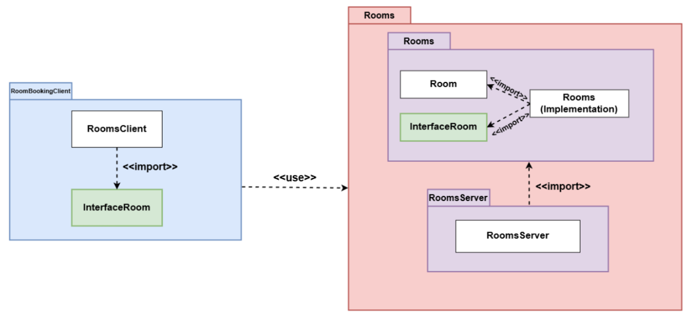
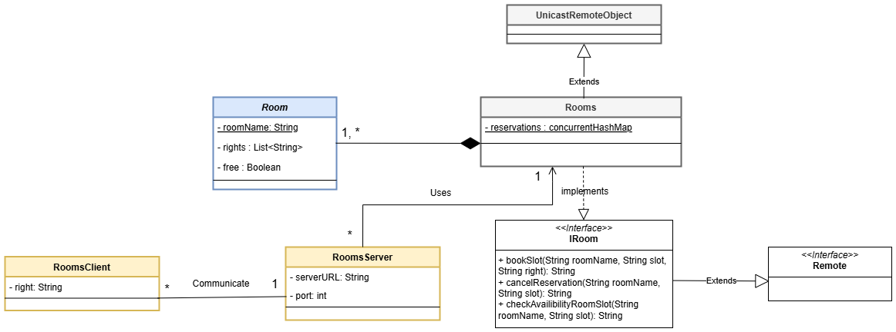

# Room Reservation System Using Java RMI

This repository contains a **Room Reservation Application** built using **Java RMI (Remote Method Invocation)** technology. The project is divided into two separate components:

1. **Rooms**: Server-side application that manages the rooms.
2. **RoomBookingClient**: Client-side application that interacts with the server to book rooms.

   UML Package diagram :
   
   

---

## Project Overview  

This project demonstrates the implementation of a distributed **Room Reservation System** using **Java RMI** technology. The server manages room availability and reservations, while clients can book, view, and manage room reservations by communicating with the server remotely.

The system is built with a **2-tier architecture** to ensure that multiple users can interact with a centralized server to:

1. **Reserve/book a Room**: Clients can book a room for a specific time slot.  
2. **Cancel Reservations**: Clients can remove existing reservations.  
3. **Check Availability**: Clients can verify room availability for specific time slots.  
4. **Admin Features**:  
   - View all registered rooms.  
   - Check available rooms for specific time slots.  

The server ensures synchronization of reservations to prevent conflicts, such as two clients booking the same room at the same time.

## Technologies Used  

- **Java**: Programming language used to implement the application logic.  
- **Java RMI**: For enabling communication between the server and the client.  
- **Eclipse IDE**: Development environment for building and testing the application.  

### Prerequisites  

1. **Java Development Kit (JDK)** (Version 8 or later).  
2. **Eclipse IDE** (or any Java IDE).  
3. **RMI Registry** (Comes with Java SDK).  

---

## I. Problem Context  

A center (facility) has several rooms that can be reserved for events. Each room has an associated schedule with available time slots. Multiple users can access the system simultaneously to:  

- **Check room availability.**  
- **Reserve a room for a specific time slot.**  
- **Cancel a reservation.**  

The actions must be synchronized to prevent conflicts when multiple clients attempt to book the same time slot simultaneously.  

   UML Component diagram : 
   
   

---

## II. Functional Scenarios  

UML Use case diagram

### 1. Reserving a Room  
- The client selects a room and a time slot.  
- The server checks if the time slot is still available.  
- If available, the reservation is recorded in the ConcurrentHashMap.  
- The method is synchronized to prevent two clients from reserving the same time slot.  

### 2. Canceling a Reservation  
- The client can cancel an existing reservation.  
- The server checks if the reservation exists and then removes it from the list of reservations.  

### 3. Checking the Availability of a Specific Room for a Specific Time Slot  
- The client sends a verification request specifying the room and time slot.  
- The server returns the result of the verification:  
  - **Available** or **Not Available**.  

### 4. Viewing the List of Available Time Slots for a Given Room (From the Current Time Onward)  
- The client queries the server to view all available time slots for a specific room.  
- The server returns a list of available time slots, if they exist.  

### 5. Checking the Availability of a Room for the Entire Day  
- The client queries the server to check if a room is available for at least one time slot during the day.  
- The server returns:  
  - **False**: If the room is reserved for all time slots for the entire day.  
  - **True**: Otherwise.  

### 6. Viewing the List of Available Rooms by Time Slot (Admin)  
- An administrator can view the list of available rooms for a specified time slot.  

### 7. Viewing the List of All Registered Rooms on the Server (Admin)  
- The administrator can retrieve a list of all rooms registered in the system.  

### 8. Conflict Management  
- If a client attempts to reserve a time slot that is already taken, the server returns an **error message** indicating the conflict.

   UML Class diagram
  

---

## Key Features  

- **Concurrent Access**: The system ensures synchronization to handle simultaneous access by multiple clients.  
- **Admin Functionality**: Administrators have enhanced privileges, such as viewing all rooms and querying specific time slots.  
- **Error Handling**: Conflicts are managed gracefully, and users are notified when a time slot is unavailable.  

---

## Technologies Used  

- **Java RMI (Remote Method Invocation)**  
- **Java SE**  

---

## Future Improvements  

- Add a graphical user interface (GUI) for ease of use.  
- Implement persistent storage using a database.  
- Introduce notifications for reservation confirmations or conflicts.  

---

## Contributors  

- **Mohamed Saber Mahjoub**  

---

## License  

This project is licensed under the **MIT License**.  

